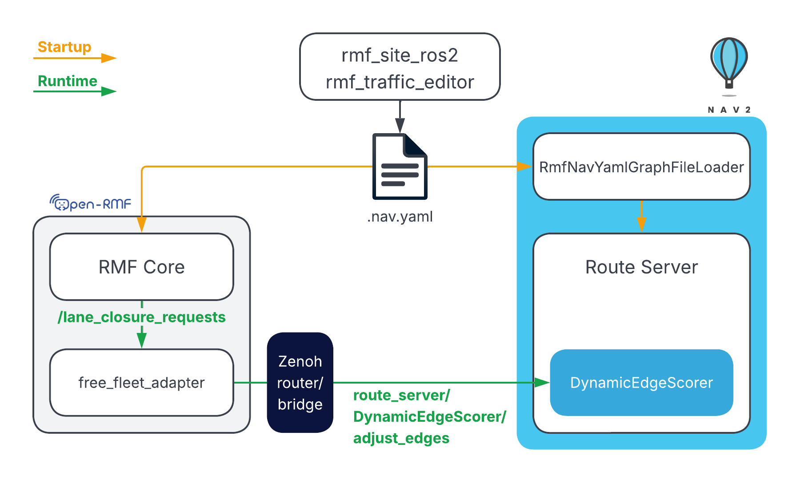

# Open-RMF ↔ Nav2 Route Sync Demo

Reference workspace for the Open-RMF ↔ Nav2 route synchronization demo on ROS 2 Jazzy.

## Overview



Open-RMF and Nav2 use the same route graph. The graph is generated at build time
from an RMF site description and loaded into Nav2 on startup. At runtime, any lane
closures or reopenings issued through Open-RMF are propagated to Nav2, so both
systems always agree on which routes are available.

Nav2 is configured with the SMAC planner and the Regulated Pure Pursuit (RPP)
controller so the robot tracks the route graph closely.

## Setup

Use this workspace from the provided devcontainer. New terminals automatically
source ROS 2 and the workspace overlay.

When the devcontainer is created, `./setup.sh` and `./build.sh` run automatically.

Re-run `./build.sh` after any source code changes.

## Running the Demo

After building the workspace, open four terminals and run the commands below in
order. Keep each process running unless noted otherwise.

### Terminal 1: Zenoh Router (Devcontainer)

Start the zenoh router in the container:

```bash
zenohd -c $(ros2 pkg prefix rmf_nav2_route_demo)/share/rmf_nav2_route_demo/config/zenohd_local_only.json5
```

You can also run `zenohd` on the host if needed. If you do, keep the bridge
endpoint and router configuration aligned.

### Terminal 2: Simulation

```bash
ros2 launch rmf_nav2_route_demo nav2.launch.py
```

### Terminal 3: Zenoh Bridge

```bash
ROS_DOMAIN_ID=0 ROS_LOCALHOST_ONLY=1 ROS_AUTOMATIC_DISCOVERY_RANGE=LOCALHOST zenoh-bridge-ros2dds -c $(ros2 pkg prefix free_fleet_examples)/share/free_fleet_examples/config/zenoh/nav2_tb3_zenoh_bridge_ros2dds_client_config.json5
```

### Terminal 4: RMF + Fleet Adapter

```bash
ros2 launch rmf_nav2_route_demo rmf.launch.xml
```

### Runtime Configuration

- The devcontainer defaults to `RMW_IMPLEMENTATION=rmw_cyclonedds_cpp` and `ROS_DOMAIN_ID=55`.
- `nav2.launch.py` runs Nav2 on `ROS_DOMAIN_ID=0`.
- `rmf.launch.xml` runs RMF on `ROS_DOMAIN_ID=55` unless you override it.
- Both launch files set localhost-only DDS discovery (`ROS_LOCALHOST_ONLY=1`, `ROS_AUTOMATIC_DISCOVERY_RANGE=LOCALHOST`) to avoid cross-talk on shared networks.
- The default Zenoh router and bridge configs are local-only (`127.0.0.1`) with Zenoh scouting/peering disabled.

If you need multi-PC communication, override the localhost-only settings above
and update bridge `connect.endpoints` accordingly.

If localization is unstable after startup, republish a manual initial pose from
another terminal:

```bash
ros2 topic pub --once /initialpose geometry_msgs/msg/PoseWithCovarianceStamped \
"{header: {frame_id: map}, pose: {pose: {position: {x: -1.6, y: -0.5, z: 0.0}, orientation: {z: 0.0, w: 1.0}}}}"
```

## Demo Actions

This sequence demonstrates lane-closure synchronization between RMF and the
Nav2 route graph.

The same closure state is propagated to the Nav2 route server, so graph-based
navigation goals sent through Nav2 also avoid closed lanes until they are reopened.

### 1. Dispatch with lanes open

With all lanes open (the default), dispatch a task. The robot traverses the corridor
through lanes `20` and `21` because it is the shortest path.

```bash
ros2 run rmf_demos_tasks dispatch_go_to_place -p north_east
```

### 2. Close lanes

Close lanes `20` and `21`. Both RMF and the Nav2 route server will treat that
corridor as unavailable.

```bash
ros2 topic pub --once /lane_closure_requests rmf_fleet_msgs/msg/LaneRequest \
	"{fleet_name: 'turtlebot3', close_lanes: [20, 21], open_lanes: []}"
```

### 3. Return to start with lanes closed

Send the robot back to its starting position. Because lanes `20` and `21` are now
closed, the robot cannot retrace the path it took to reach `north_east` and will use
an alternate route instead.

```bash
ros2 run rmf_demos_tasks dispatch_go_to_place -p tb3_charger
```

### 4. Reopen lanes

Reopen the corridor. Subsequent RMF dispatches and Nav2 graph-based goals can use
that route again.

```bash
ros2 topic pub --once /lane_closure_requests rmf_fleet_msgs/msg/LaneRequest \
	"{fleet_name: 'turtlebot3', close_lanes: [], open_lanes: [20, 21]}"
```

## License

This project is licensed under the Apache License 2.0. See [LICENSE](LICENSE) for details.